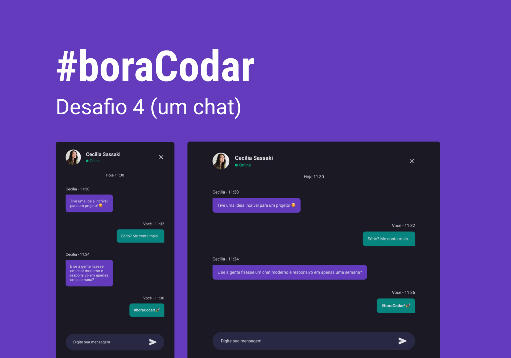

<h1 align="center"> Desafio da Rocketseat </h1>

Um pequeno projeto do desafio #boraCodar.

  <a href="#-tecnologias">Tecnologias</a>&nbsp;&nbsp;&nbsp;|&nbsp;&nbsp;&nbsp;
  <a href="#-projeto">Projeto</a>&nbsp;&nbsp;&nbsp;|&nbsp;&nbsp;&nbsp;
  <a href="#memo-licença">Licença</a>

  

 

  

## 🚀 Tecnologias

Esse projeto foi desenvolvido com as seguintes tecnologias:

- HTML
- CSS
- JavaScript
- Git e Github

 

## 💻 Projeto

Site desenvolvido para conclusão do desafio da boraCodar, da Rocketseat. Um chat bot de conversa.

- [Acesse o projeto finalizado, online](https://joao2g.github.io/boracodar-desafio-04/)

 

## 🔖 Layout

Você pode visualizar o layout do projeto através [DESSE LINK](<https://www.figma.com/file/s9ajP3Gtx9nCX9l6TDhBvw/%23boraCodar---Desafio-4-(Community)?node-id=7%3A3&t=mSM48mOHKajSp9km-0>). É necessário ter conta no [Figma](https://figma.com) para acessá-lo.

 

## 📝 Licença

Esse projeto está sob a licença MIT.
